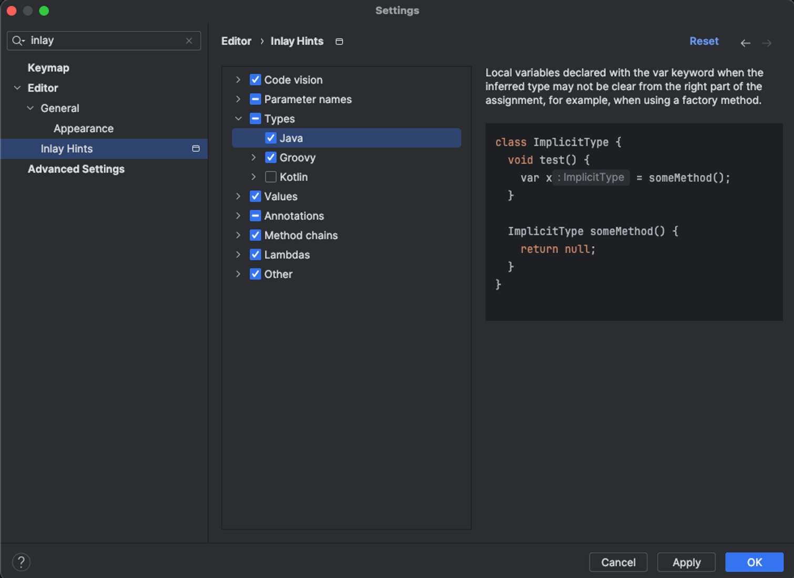
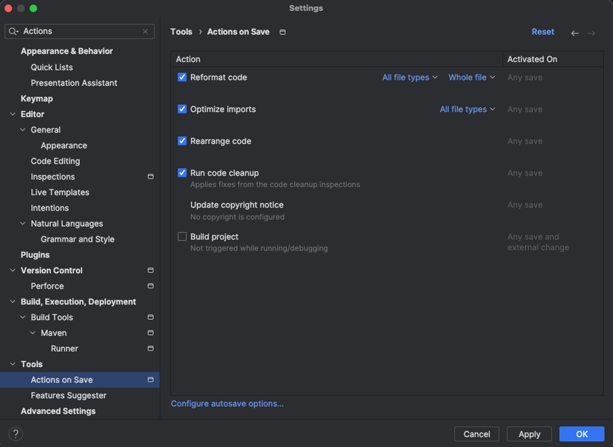

# GDSC Forum API
GDSC Forum 스프링 부트 API 서버입니다.

## 💻 Coding Convention
- 컨벤션은 강하게 가져가진 않겠습니다. 각자의 프로젝트에 도움이 되도록 참고만 해주세요.

<details>
 <summary> 🗂 패키지 구조 </summary>
 <div markdown="1">       

---
```markdown

🗂 node_modules
   
🗂 src/main/java/com/example/gdscforum

    - common 🗂

        - exceptions 🗂

        - configurations 🗂

        - dto 🗂

        - enums 🗂

        - 기타 글로벌 패키지 🗂

    - domain 🗂

        - auth 🗂

            - controller 🗂

                - request 🗂

                - response 🗂

            - service 🗂

            - repository 🗂

            - entity 🗂

            - dto 🗂

        - dev 🗂

            - 이하 동일 🗂

        - post 🗂

        - 비즈니스 도메인 단위 패키지 🗂
   

build.gradle
   
settings.gradle
   
gradlew
```
- 기본적인 프로젝트의 패키지 구조입니다. 위 구조를 기본으로 하되 상황에 맞게 적절히 변형하여 사용하시면 됩니다.
- `common` : 공통으로 사용되는 패키지
  - 공통으로 사용되는 설정 및 클래스들이 위치하는 패키지입니다.
  - 하위에 상황에 맞는 패키지 구조를 추가할 수 있습니다.
- `domain` : 비즈니스 도메인 단위 패키지
  - 비즈니스 도메인 단위로 패키지를 구성합니다.
  - 각 도메인 패키지 하위에 상황에 맞는 패키지 구조를 추가할 수 있습니다.
<br>
 </div>
 </details>


<details>
<summary> 🖋 네이밍 </summary>
<div markdown="1">       


---

**Class & Contructor**

- Class, Contructors는 **Pascal Case (=UpperCamelCase)**를 사용합니다.

  <kbd>좋은 예</kbd>

    ```java
    CamelCase
    ```

  <kbd>나쁜 예</kbd>

    ```java
    camelCase
    ```
<br/>

**함수 & 변수 &상수**

- 함수와 변수에는 **lowerCamelCase**를 사용합니다.

- 함수의 경우 **동사+명사**형태로 구성합니다.
    - ex) getUserInformation()

- 글자의 길이
    - 글자의 길이는 **20자 이내**로 제한합니다.
    - 4단어 이상이 들어가거나, 부득이하게 20자 이상이 되는 경우에는 **팀원과의 상의**를 거쳐야 합니다.

- flag로 사용되는 변수
    - Boolean의 경우 **조동사+flag** 종류로 구성합니다.
    - ex) isNum, hasNum

- 기본적인 데이터 핸들링에서는 Array 보다는 List를 지향합니다.
  - List를 사용하면 데이터의 추가, 삭제, 검색 등이 편리합니다. 
  - ex) List<String> list = new ArrayList<>();

- 약칭의 사용
    - 약어는 되도록 사용하지 않습니다.

  <kbd>좋은 예</kbd>

    ```java
    String index;
    int count;
    List<String> list;
    boolean seoulToBucheon;
    ```

  <kbd>나쁜 예</kbd>

    ```java
    String idx;
    int cnt;
    String[] arr;
    boolean seoul2Bucheon;
    ```
<br>

</div>
</details>


 <details>
 <summary> 🏷 주석 </summary>
 <div markdown="1">       

---

- 한줄은 `//`로 적고, 그 이상은 `/** */`로 적습니다.
 ```java
 // 한줄 주석일 때
 /**
  * 여러줄
  * 주석일 때
  */
 ```

 <br>

 </div>
 </details>


<details>
<summary> 📎 기타 </summary>
<div markdown="1">       


---

- 탭 사이즈는 4로 사용합니다.
  - intellij 설정에서 indent를 검색하면 설정할 수 있습니다.
- 한 줄의 최대 길이는 80자로 제한합니다.
- 괄호 사용
    - (if, while, for)문 괄호 뒤에 한칸을 띄우고 사용합니다.
  ```java
     if (left == true) {
	   // logic
     }
     ```

- 띄어쓰기
  ```java
  int a = 5;  ( = 양쪽 사이로 띄어쓰기 하기)
  if (a == 3) {
	  // logic
  }
  ```
- 유용한 설정
  - inlay hints: 변수 타입 미리보기
    
  - Actions on Save: 저장(Ctrl+s)시 액션
    
</div>
</details>


</br>

## ✉️ Commit Messge Rules
<details>
<summary> Git Commit Message Rules </summary>
<div markdown="1">       


---

- 반영사항을 바로 확인할 수 있도록 작은 기능 하나라도 구현되면 커밋을 권장합니다.
- 기능 구현이 완벽하지 않을 땐, 각자 브랜치에 커밋을 해주세요.
  <br>


### 📜 커밋 메시지 명령어 모음

```
- feat    : 기능 (새로운 기능)
- fix     : 버그 (버그 수정)
- refactor: 리팩토링
- style   : 스타일 (코드 형식, 세미콜론 추가: 비즈니스 로직에 변경 없음)
- docs    : 문서 (문서 추가, 수정, 삭제)
- test    : 테스트 (테스트 코드 추가, 수정, 삭제: 비즈니스 로직에 변경 없음)
- chore   : 기타 변경사항 (빌드 스크립트 수정 등)
```
<br>

### ℹ️ 커밋 메세지 형식
- `[커밋메세지] 설명` 형식으로 커밋 메시지를 작성합니다.

좋은 예 >

```
  [Feat] 메인뷰 조회 API 구현 완료
```

나쁜 예 >
```
  메인뷰 API 구현 성공
```

</div>
</details>
<br>

##  Github mangement
<details>
<summary> Gitflow </summary>
<div markdown="1">       


---

- main 브랜치
    - 개인 브랜치(예: HwangonJang)
      - feat 브랜치
- default는 main브랜치입니다.
- 하위에 개인 브랜치를 자신의 이름으로 만들어 안전하게 관리합니다.
- 기능 개발시 → 개인 브랜치 하위에 feat/주차 으로 브랜치를 파서 관리합니다.
- 단 feat은 주 단위의 과제 한 가지를 담당하며, 기능 개발이 완료되면 본인의 개인 브랜치로 Pull Request를 보냅니다.
- 다른 팀원이 pr을 확인하고, 코드리뷰를 진행한 뒤 문제가 없으면 개인 브랜치에 병합을 합니다.
- main 브랜치는 default 이지만 중요하지 않은 브랜치입니다. 최종 배포 시에만 사용합니다.

<br>

```
- main
    └── name1
        └── feat/1주차
        └── feat/2주차
    └── name2
        └── feat/1주차
    └── name3
        └── feat/1주차
        └── feat/2주차
            └── feat/3주차
```

<br>

**각자 자신이 맡은 기능 구현에 성공시! 브랜치 다 쓰고 병합하는 방법**

- 브랜치 만듦

```bash
git branch 기능(or 이름 브랜치)
```

- 원격 저장소에 로컬 브랜치 push

```bash
git push --set-upstream origin 브랜치이름(feat/주차 브랜치)
```
```bash
git push -u origin 브랜치이름(feat/주차 브랜치)
```


- 브랜치 전환

```bash
git checkout feat/주차 브랜치
```

- 코드 변경 (현재 **feat/주차** 브랜치)

```bash
git add .
git commit -m "커밋 메세지" origin feat/주차 브랜치
```

- 푸시 (현재 **feat/주차** 브랜치)

```bash
git push origin feat/주차 브랜치
```

- feat 브랜치에서 할 일 다 했으면 **개인** 브랜치로 전환

```bash
git checkout {name}
```

- 머지 (현재 **개인** 브랜치)

```bash
git merge feat/주차 브랜치
```

- 다 쓴 브랜치 삭제 (local) (현재 **개인** 브랜치)

```bash
git branch -d feat/주차 브랜치
```

- 다 쓴 브랜치 삭제 (remote) (현재 **개인** 브랜치)

```bash
git push origin :feat/주차 브랜치
```

- main pull (현재 **개인** 브랜치)

```bash
git pull or git pull origin develop
```

- main push (현재 **개인** 브랜치)

```bash
git push or git push origin develop
```
</div>
</details>